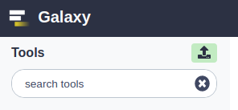
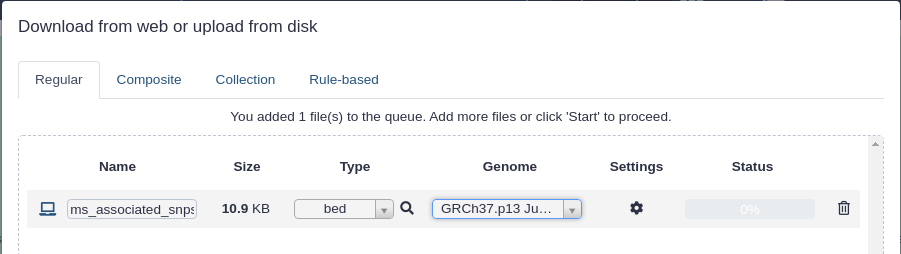
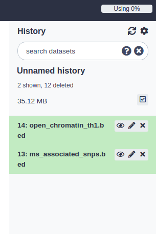
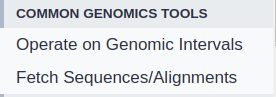
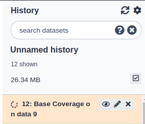

# Exercise 1 - Galaxy

In this exercise we will use Galaxy hosted on [http://usegalaxy.org](http://usegalaxy.org).

### Before you start
* Open [usegalaxy.org](https://usegalaxy.org) in you web browser and register a new user by click **Login or register** in the top toolbar. This is not strictly necessary, but will make you history be saved.

## 1: Upload data
Most analyses in Galaxy starts out with some dataset that goes as input to a tool.

You upload data by pressing the **green upload symbol** which you will find at the top of the left menu:

We want to upload two files. Download these to your laptop first:
* [this BED file with open chromatin regions](https://raw.githubusercontent.com/uio-bmi/statistical_genomics_exercises/master/open_chromatin_th1.bed) 
* [this BED file with SNP positions](https://raw.githubusercontent.com/uio-bmi/statistical_genomics_exercises/master/ms_associated_snps.bed) 

After downloading these files to your computer, uplaod them to galaxy by using the upload tool. Select "bed" as type and "GRCh37.p13" as Genome. Usually Galaxy will manage to automatically detect the type, but it does not hurt to let it know the type either:

After clicking the **start** button, the files will upload and appear as green history elements on the right side of the screen once finished. While processing, the history elements will be gray or orange. Once finished, you can click the eye icon on the history element to see the data.

Make sure you have these two files in your history before you continue:

## 2: How many SNPs do we have?
We do not need any fancy tools to answer this question, as Galaxy will show us the number of "regions" on the history element on the right side. See if you can find this information there.

## 3: How much of the genome is covered by the open chromatin regions?
To answer this question, we will use the tool **Base coverage** which can be found under the header **Operate on Genomic Intervals**  in the left menu:

Click on **Operate on Genomic Intervals** and find the tool **Base coverage**.

Select the open chromatin bed file you uploaded and run the tool. If you have done this correctly, a history element will appear on the right side. This job may take a few seconds to run, and will turn green once finished. Then you can click the eye symbol to see the results:

## 4: How many SNPs are inside open chromatin regions?
To answer this question, we will use the **Intersect** tool, which can be found under the same sub menu as the **Base coverage** tool.

The **Intersect** tool can find all intervals in one file that intersects the intervals in another file.

Try to use this tool to find all SNPs that intersect the open chromatin regions. Since SNP intervals are always 1 base pair in length, each SNPs will either intersect open chromatin or not.

Find out **how many** SNPs are inside the open chromatin regions by checking how many elements are returned in the resulting history element.

## 5: Bonus task
If you have time left, use the **bedtools ShuffleBed** tool in Galaxy to make a shuffled version of the open chromatin regions. Specify the input parameters to this tool yourself. How many of the SNPs intersect with these shuffled regions?

 

