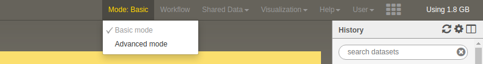
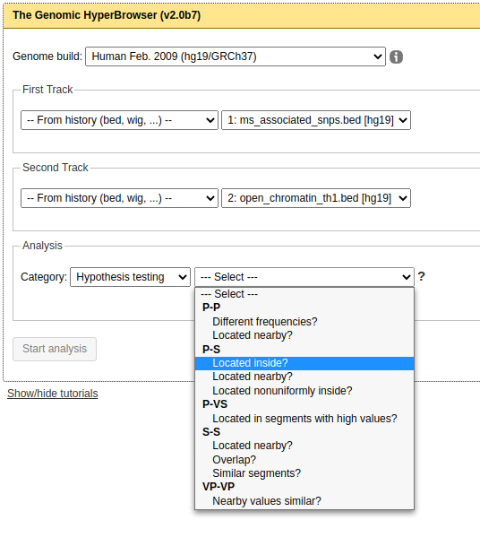

# Exercise 2: Using the Genomic Hyperbrowser

[The Genomic Hyperbrowser](https://hyperbrowser.uio.no/hb/#!mode=advanced) is a web-platform that is built on top of Galaxy. Thus, it has a very similar user interface. In addition to standard Galaxy tools, it has a lot of tools focused specifically on statistical genomics.

## 1: Register a user

When first visiting the Genomic Hyperbrowser, you are most likely in *Basic Mode*. Change to *Advanced Mode* by clicking on *Basic Mode* on the top menu bar:

After that, you should see a menu to the left and a history column to the right.

Register a user similarly to how you did this on Galaxy.

## 2: Upload data
Upload the two same files from the [Galaxy exercise](Exercise1-Galaxy.md) again.

Remember to set type to **bed** and genome to **hg19**.

## 3: Perform the analysis 
We now want to use a tool called **Analyze genomic track** which is a quite powerful tool that can take two genomic tracks and ask questions like *Do these tracks overlap more/less than expected by chance?*

Specifically, we want to investigate whether the SNPs fall more inside regions of open chromatin than expected by chance.

Go to **Statistical analysis of tracks** in the left menu and then **Analyze genomic track**.
* Select hg19 as the genome build
* For the first track, select **from history** and select the SNP track
* For the second track, select **from history** and select the open chromatin track

We want to do **hypothesis testing** so select that in the Analysis selection. You will get a second choice where you are asked to choose between the options shown here:

The **P** and **S** refer to **P**oints and **S**egments. We want to investigate whether points (the SNPs) are located more often inside the segments (open chromatin) than expected by chance. So select **Located inside?** under **P-S**.

For the rest of the options that appear, you don't need to change anything, except for:
* Set Random seed to 0
* Pick one of the null models (either arbitrary or based on some intuition).

Run the analysis. If you have time, re-run with different null models or set MCFDR sampling depth to "moderate resolution". Compare the results of the different runs.

We will go through all the options and what they mean togheter. For now, try to play around with the tool if you have time.
