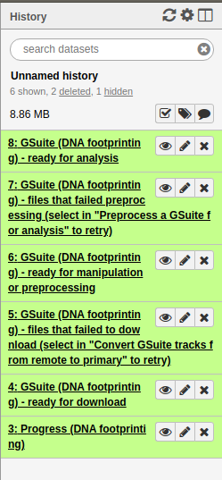

# Exercise 3: The Genomic Hyperbrowser

We now want to perform the same analysis we [performed using bedtools](Exercise3-Bedtools.md), but instead use the Genomic Hyperbrowser.

Using the Genomic Hyperbrowser, there are a few benefits:
* It lets us collect open chromatin data sets from various online repositories, so we can collect a lot of tracks
* We don't need to run something manually for every data set. We can use one tool to compare the SNPs against all tracks
* We can use various similarity measures (bedtools only support Jaccard, which is [known to have some issues](https://academic.oup.com/bib/article-abstract/21/5/1523/5586919))

It is good to have done [the previous exercise on the Genomic Hyperbrowser](Exercise2-Hyperbrowser.md) so that you have gotten used to the user interface.

## 1: Make a "GSuite" file containing all the open chromatin tracks we want to analyse
The Genomic Hyperbrowser can compare one track against a "suite" of other tracks, by making something it calls a **Gsuite**.

* Click **Create a GSuite of genomic tracks** at the top of the left menu and go to **Create a GSuite from an integrated catalog of genomic datasets**
* Select **Open chromatin**
* Select **DNA Footprinting**
* Don't change anyting, and click **Execute**

You will get a lot of history elements, but don't be scared by that:

Most of these history elements are just giving you information about how the processing of the files went. It is the last history element saysing **ready for analysis** that we can use 
in further analysis. This is basically one file containing many genomic tracks.

Before you continue, also make sure you have the SNP bed file from the previous exercises in this history.

## 2: Compute the similarity between the SNPs and all the genomic tracks
* Go to **Statistical analysis of GSuites** in the left menu and click on **Determine GSuite tracks coinciding with a target track**
* Select the SNPs as *query track*
* Select the track ending with **- ready for analysis** as *reference GSuite*

We want to rank the tracks in the GSuite by similarity to the query track (not compute any p-values).

Pick a similarity measure (feel free to re-run the analysis with different similarity measures).

NB: Under **Select track attributes to display with the results page** check off **cell/tissue type**. That way, we will get the cell/tissue type for the different tracks in our report.

In which cell type is the open chromatin most associated with the SNPs? If you have time, try googling Multiple Sclerosis and this cell type to see if you can find any research relating to your findings.

